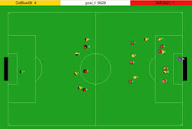

welcome to the kn2c_rcss_2d repository

These scripts is developed by **KN2C robotic team** for running multiple games between different teams. it can be used for testing or hosting competition purposes.

These scripts are developed in a way so you can use them with ease without any need for knowledge of shell commands and shell scripting. 

---

#### This project run in:

- [x] local mode
- [x] remote mode 

---

### features:

1. Tagging for each game (look at the instructions)
2. Running multiple games on multiple ports.
3. Ports start and difference can be specified
4. Saving results in a file and saving results
5. Recognizing teams by nicknames (folder names - look at the instructions)
6. kill script(port specific and killall)
7. handle results of penalties

---

### How to use

first clone this repository in your system

you have 2 choice for run the games:

**run in local : **

1. Put all of the teams in "teams" folder in the same folder as the scripts. (each team should have a *startAll* script that gets the port that games is going to be run on and run all of the players and coach)

*startAll*:

```bash
#!/bin/sh
#$1 ---> port
DIR="$(dirname $0)"
$DIR/src/start.sh -p $1
```

2. Specify games in "Games.txt" in the following formant: "Team1 Team2 tag". tag is optional. teams will be recognized by their folder name.

3. simply run start.sh script:

```bash
 ./start.sh
```

you see command like this:

> ./start.sh 
>
> enter path of teams directory: 
>
> ./teams
>
> enter path of results directory: 
>
> ./results
>
> enter number of games running simultaneously: 
>
> n=1
>
> enter servers start port: 
>
> ssp=6000
>
> enter servers port difference: 
>
> spd=10
>
> [=======================================================>
>
> Done!

To kill process

- run kill.sh script (if you want to kill processes of a single port you can specify it as input otherwise it would kill all the processes involved)

`./kill.sh `

`./kill.sh current port`

- run killall.sh script to killall scripts

`./killall.sh`

**run in remote mode**

1. after putting teams in teams directory and write the Games.txt you should fill masterAddress.txt and fill remoteAddresses.txt 

2. next set ssh key in master and other systems 

3. simply run startRemote script:

`./startRemote.sh`

---

### results 

you can see results directory and Results.txt into it

next you can use the clearResults.sh script for clear all of the logs and results of games!

`./clearResults.sh`

---

### suggest (optional)

There is another monitor which has more detailed information about matches and players information. This monitor is used in the official Robocup World Cup. If you wish to install it, just run these commands:

In the RoboCup repository cited above in this tutorial, download this [file](https://osdn.net/projects/rctools/releases/p4886).

Open a terminal and run:

> tar -zxpf soccerwindow2-x.x.x.tar.gz
> cd soccerwindow2-x.x.x.tar.gz
> ./configure
> make
> sudo make install

---

### contact

- amir.mirzaei1379@gmail.com
- arash.saatchi99@gmail.com


