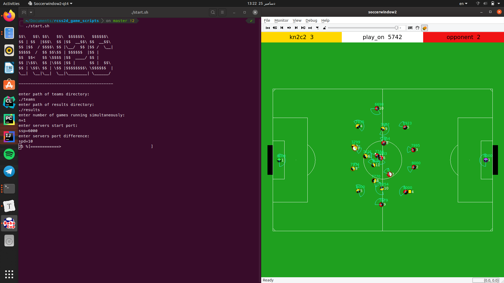

## 2D Game Runner

	

Game Runner is developed by **KN2C robotic team** for running multiple games between different teams. it can be used for testing or hosting competitions.

Game Runner is  developed in a way so you can use them with ease without any need for knowledge of shell commands and shell scripting. 

------

### Maintainers

**KN2C Robotic Team**

- Amir Mirzaei - <amir.mirzaei1379@gmail.com>
- Arash Saatchi - <arash.saatchi99@gmail.com>

[KN2C Website](http://kn2c.aras.kntu.ac.ir/)

  

---

### Features:

1. Tagging each game. (see Instructions)
2. Running multiple games on multiple ports (om a single computer).
3. Running multiple games on multiple (remote) servers and ports.
4. Ports start and difference can be specified.
5. Saving game logs with their tag. (see Instructions)
6. Saving game results in a general file.
7. Saving game results in a separate file for each tag.
8. Recognizing teams by nicknames. (folder names - see Instructions)
9. Including kill script. (port and remote specific in addition to kill all)
10. Handling results of penalty shoot-outs.
11. Showing progress using progress bar.

---

### Instructions

Game Runner are designed for two ways of running; Running on local computer and Running on multiple remote servers.

You can add new games while other games are running.

Game Runner also contain kill scripts.

#### Instructions for running on local PC

1. Put each team's binaries in a folder with their name under teams folder. Default path for teams folder is `GAME_RUNNER_FOLDER/teams` but can be changed. (Format of teams binaries is described below)

2. Add Games in Games.txt file in data folder in root folder of Game Tools.

   Each line of Games.txt should contain exactly one game in the following format.

   `Team1 Team2`

   or

   `Team1 Team2 Tag`

   Specifying tag for games is optional.

3. Run start.sh script. You will be asked for the following:
   1. Teams folder: The folder you put teams binaries in. (as mentioned above `GAME_RUNNER_FOLDER/teams` is default folder, if you placed teams binaries in a different folder enter it's path here)
   2. Results folder: The folder results will be saved in. (Default is `GAME_RUNNER_FOLDER/results`)
   3. Number of games running simultaneously
   4. Server start port: Servers will be run on this port and above. (Default is 6000, leave untouched if you are unsure)
   5. Server port difference: Difference between server ports. (Default is 10, should at least be 3. leave untouched if you are unsure)

Wait for games to finish.

#### Instructions for running on remote servers

1. Add ssh key of master(id_rsa.pub) to `~/.ssh/authorized_keys` in all remote servers and add them as trusted servers in master.

2. Add ssh key of every remote server(id_rsa.pub) to `~/.ssh/authorized_keys` in master and add master as a trusted server in them.

3. ssh server should be running in all of the remote servers and master and should be listening on port 22.

4. Add your remote servers address to remoteAddresses.txt file in data folder in root folder of Game Runner in the following format

   `user@server_address number_of_games_on_this_server`

   or

   `user@server_address Number_of_games_on_this_server Path_for_Game_Files`

   Adding a path for game files is optional, if you don't start your path from root (`/...`) it will be started from home directory of the user specified.  User specified should have access to the folder you add for game files.

   **additional note:** If you already have a server in remoteAddresses.txt that is currently unavailable you don't have to remove it. you can disable it by adding a '#' to begging of it's line.

5. Add master address to masterAddress.txt file in data folder in root folder of Game Runner in the following format

   `master_user@master_address`

6. Put each team's binaries in a folder with their name under teams folder. Default path for teams folder is `GAME_RUNNER_FOLDER/teams` but can be changed. (Format of teams binaries is described below)

7. Add Games in Games.txt file in data folder in root folder of Game Runner.

   Each line of Games.txt should contain exactly one game in the following format.

   `Team1 Team2`

   or

   `Team1 Team2 Tag`

   Specifying tag for games is optional.

8. Run startRemote.sh script. You will be asked for the following:

   1. Teams folder: The folder you put teams binaries in. (as mentioned above `GAME_RUNNER_FOLDER/teams` is default folder, if you placed teams binaries in a different folder enter it's path here)
   2. Results folder: The folder results will be saved in. (Default is `GAME_RUNNER_FOLDER/results`)
   3. Server start port: Servers will be run on this port and above. (Default is 6000, leave untouched if you are unsure)
   4. Server port difference: Difference between server ports. (Default is 10, should at least be 3. leave untouched if you are unsure)

Wait for games to finish.

##### Instructions for adding games while Game Runner is running

You can add new games while Game Runner is running in both local and remote modes. For this simply open Games.txt file and add new games in the end with same format as rest of the games. Here each line should contain exactly one game (no blank or only space line).

**Attention:** Adding new games while last n (number of simultaneous games)  are running is unsafe and is not guaranteed that Game Runner run those games as well. 

##### Instructions for local kill

To kill the whole process simply run kill script:

`./kill.sh`

If you want to kill a specific game, first find the ports the game is running on, then give the port to kill as an argument. like this 

`./kill.sh Number_of_port`

**Attention:** Using kill for remote games and killRemote for local games is unsafe, use every one in it's place.

##### Instructions for remote kill

To kill the whole process simply run killRemote script:

`./killRemote.sh`

If you want to kill a specific game, first find the number of the line of the server in remoteAddresses.txt and then the number of the port for that game on it's server, then give them to killRemote as argument. like this

`./killRemote.sh Line_of_the_server Nubmer_of_port` 

**Attention:** Using kill for remote games and killRemote for local games is unsafe, use every one in it's place.

##### Instructions for results.sh

1. Run results.sh in a shell.

2. You will be asked if you want to save results in a file in addition to seeing them. Enter y for yes, n for no. If you don't Enter any of them or take more than 10 seconds, script assumes you don't want to use this option

3. If you entered yes (y) in previous step you will be asked for a path for the save file if you don't specify or take more than 30 seconds, default location (./Saved_Results.txt) will be assumed.

4. You will be asked if you want results of a specific tag. If you do not enter anything or take more than 10 seconds, script shows (and saves if you chose to) all of the tags.

   

##### Instructions for clear results

Simply run the script.

`./clearResults.sh`

**Attention:** "paths.txt" file should exist before running. 

##### Instructions for clear Remote

Simply run the script.

`./clearRemote.sh`

**Attention:** "remoteAddresses.txt" file should exist before running. 

------

### Team's Binaries format

Each team's binaries should be in a folder with their name (Teams will be recognized by folder names in Game Runner). The only necessity is that each team should have a "startAll" executable in their folder.

The "startAll" executable should get a command line argument port and start all of the agents (and coach) on the given port. 

---

### After run 

Results and log files will be saved inside results folder which can be specified (see Instructions).

Results are saved on Results.txt file.

If a tag is included the logs will be saved in a folder with tag name inside results folder. In addition results of the tag will be saved in Results.txt inside tag folder as well as the main Results.txt file.

You can also use results.sh script to see, filter and save results.

##### Instructions for results.sh

1. Run results.sh in a shell.
2. You will be asked if you want to save results in a file in addition to seeing them. Enter y for yes, n for no. If you don't Enter any of them or take more than 10 seconds, script assumes you don't want to use this option
3. If you entered yes (y) in previous step you will be asked for a path for the save file if you don't specify or take more than 30 seconds, default location (./Saved_Results.txt) will be assumed.
4. You will be asked if you want results of a specific tag. If you do not enter anything or take more than 10 seconds, script shows (and saves if you chose to) all of the tags.

---

#### Additional Suggestion

There is another monitor which has more detailed information about matches and players information. This monitor is used in the official Robocup World Cup. If you wish to install it, just run these commands:

In the RoboCup repository cited above in this tutorial, download this [file](https://osdn.net/projects/rctools/releases/p4886).

Open a terminal and run:

> tar -zxpf soccerwindow2-x.x.x.tar.gz
>
> cd soccerwindow2-x.x.x.tar.gz
>
> ./configure
>
> make
>
> sudo make install

---

#### Done:

- [x] Local simultaneous games handling.
- [x] Remote simultaneous games handling.
- [x] Optional Tagging for games.
- [x] Writing kill scripts for killing whole process.
- [x] Writing port specific kill scripts.
- [x] Adding default and input paths for teams folder.
- [x] Adding default and input paths for results folder.
- [x] Writing script for filtering results.
- [x] Adding progress bar.
- [x] Saving logs by date and teams nicknames.
- [x] Handling result of penalty shoot-outs.
- [x] Saving logs separately by their tag.
- [x] Saving Results generally and separately by their tags.

#### To Do:

- [ ] Adding tag specific kill to Game Runner.
- [ ] Improving user interface.
- [ ] Adding scripts for adding servers and games.
- [ ] Adding remote specific kill (to kill all of the game currently running on remote)
